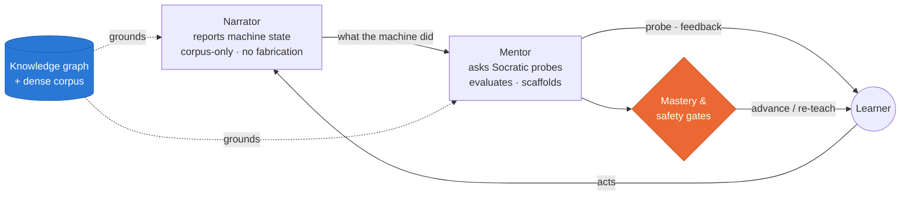

<div align="center">

<picture>
  <source media="(prefers-color-scheme: dark)" srcset="docs/assets/readme/hero-dark.svg">
  
</picture>

<br><br>

[](LICENSE)
[](https://www.experttrace.org)
[](#quickstart)
[](docs/arxiv/main.pdf)
[](#project-structure)

**[Live demo](https://www.experttrace.org)** · **[Why it looks this way](OVERVIEW.md)** · **[How it works](#how-it-works)** · **[Quickstart](#quickstart)** · **[Docs](#documentation)**

</div>

---

**TeachMe** is a domain-agnostic, **corpus-bound** training platform for safety-critical technical work. It doesn't just answer questions — it *asks* them: Socratic probes calibrated to your level, situated fault scenarios, and a narrator that **refuses to fabricate** — every machine response traces back to a node in a reviewed knowledge graph.

The flagship instantiation is **EDDIE** — Aerosol Jet Printing (AJP) operator training on the Optomec HD2. The same engine runs other procedurally-structured, safety-critical domains (roadside tire change, COLREG collision avoidance) to show the paradigm generalizes.

> [!NOTE]
> **Runs with no API key** in a deterministic *simulated* mode. Add a Gemini key via the gear icon (BYOK) for LLM-powered mentoring and dense retrieval. Outcomes shown in the app are **simulation-based mechanism evidence**, not human-subject external-validity results.

## Why it's different

| | | |
|---|---|---|
| 🧭 **It asks, it doesn't tell** | Retrieval practice beats re-reading. The Mentor opens with a probe, not an explanation — every attempt, right or wrong, is encoded as a memory-strengthening event. | *[The learning science →](OVERVIEW.md)* |
| 🔒 **Corpus-bound narrator** | The Narrator reports machine behavior *only* from the knowledge graph. A missing fact yields "I can't find that," never a plausible hallucination — the correct failure mode for safety-critical training. | *[Data provenance →](docs/DATA_CATALOG.md)* |
| 🧩 **One engine, many domains** | A typed knowledge graph → corpus-bound Narrator → Socratic Mentor → mastery/safety gates. Author a new domain as a graph + corpus and it inherits the whole instructional surface. | *[Domains →](#teaching-domains)* |

## How it works

The **TeachMe Loop**: the learner acts on a simulated machine, the Narrator reports what happened straight from the corpus, and the Mentor turns every step into a Socratic probe — with mastery and safety gates deciding when to advance versus re-teach.



Four instructional modes are **sequenced** to keep cognitive load below threshold — concept mastery before procedure, procedure before diagnosis:

| Mode | What you do |
|---|---|
| **01 · Socratic Practice** | Concept-by-concept practice with LLM-evaluated free-text responses. |
| **02 · Scenario Mode** | Narrator + Mentor drive a procedural fault scenario end-to-end (gated on verified safety checks). |
| **03 · Workflow Demo** | Watch the full Mentor evaluation loop, optionally driven by a Simulated Learner. |
| **04 · Reachback Lookup** | Search the symptom → fault → action graph from the operator's seat. |

> The toolbar's **operator-state** toggle is the cognitive-load switch: **Training** shows everything; **High-stress ops** strips the chrome and leaves only the Dashboard and corpus-bound Reachback for an operator at the machine under time pressure.

## Teaching domains

A **domain switcher** in the header selects the active domain; each self-registers via `src/corpus/registry.ts`.

| Domain | What it covers |
|---|---|
| 🖨️ **Aerosol Jet Printing** | The original, engine-backed domain (retrieval + narrator baked in) — all surfaces apply. |
| 🛞 **Roadside Tire Change** | A procedural, safety-critical domain (`src/corpus/tire/`) proving the paradigm generalizes: scenarios, probes, safety gates, consequences. |
| ⚓ **COLREG — Collision Avoidance** | The maritime "rules of the road" (`src/corpus/colreg/`) — head-on / crossing / overtaking / stand-on / restricted-visibility encounters, give-way duties, safe speed, risk of collision. |

COLREG also ships an **interactive simulator** with real kinematics — speed/heading controls, turn-radius limits, an elliptical ship domain, a Collision Risk Index, per-rule compliance scoring, and SB-MPC / velocity-obstacle reference solvers.

<sub>COLREG deep-dives: [simulator design](docs/colreg-simulator-design.md) · [validation methodology](docs/colreg-validation.md) · [concept of operations](docs/colreg-conops.md) · [whitepaper](docs/planning/colreg-whitepaper.md)</sub>

## Experiments — the measurement paper

The research contribution is an **in-silico instrument that measures *corpus necessity*** — whether a
learner actually *relies* on a corpus item (**relied-on** vs. **redundant** vs. **unusable**) as a
behavioral outcome, calibrated by weight-level construction, *before* an expensive human trial. A
quality metric (RAGAS-style) can't see this: it scores the answer, not the reliance. Three
contributions: **C1** Corpus Diagnosis (localize a gap · per-item necessity/leakage · split a leaking
item into *redundant* vs *unusable*) · **C1b** Corpus Sufficiency (incl. **FALSE SUFFICIENCY**) ·
**C2** the Transfer Instrument (the regret-vs-reference objective that makes C1 scorable).

Every result below is **simulation / mechanism evidence**; the human trial is future work. Canonical
status register: [`docs/experiment-status.md`](docs/experiment-status.md) · paper:
[`docs/arxiv/main.pdf`](docs/arxiv/main.pdf).

**Main spine — the instrument, the diagnosis, and its weight-level validation**

| Exp | Purpose | Core result |
|---|---|---|
| **0 · Instrument construct validity** (COLREG, C2) | does the metric separate skill? | do-nothing collides, velocity-obstacle / MPC clear; ranking + gradient invariant over 232 weight perturbations (Kendall τ = 1.00) |
| **0b · Second sim domain** (tire-change, C2) | does it generalize past continuous control? | discrete procedural instrument: expert J=0 vs reckless J=200, exact knowledge-component→metric identifiability, monotone gradient |
| **1 · Cross-model leakage**, standard COLREG (C1ii) | is a textbook corpus necessary? | every frontier model reads standard COLREG **redundant** — the corpus duplicates parametric knowledge (an actionable "don't ship it") |
| **1b · Cross-model hazard discrimination**, class×size (C1ii/iii) | does necessity discriminate models on a corpus-only fact? | necessity spans **0 → 1998** across Claude/Llama/Nova; only **Opus** reads the hazard corpus-bound at the full barrier; **Llama-70B & Nova-micro unusable** (ground even with the rule); standard rules redundant/FALSE-SUFFICIENCY across the board *(OpenAI gpt-oss being added)* |
| **3 · Corpus-value audit / localization** (C1i) | attribute reliance to a *specific* rule | 4-rule necessity ranking on real models; standard rules redundant, hazard corpus-bound; Rule 15 reads redundant given Rule 14 (decomposability) |
| **3b · redundant vs *unusable* split** (C1iii) | is a leaking item drop-it or fix-the-model? | split by with-corpus performance; observed on a real model (Llama-70B hazard = unusable, with-corpus regret at the full barrier) |
| **8 · Corpus sufficiency + FALSE SUFFICIENCY** (C1b) | roll per-item verdicts into a corpus-level verdict | `contributing`/`partial`/`unusable`/**FALSE SUFFICIENCY** (looks sufficient, necessity ≈ 0 → coasts on priors, fragile to shift); fires on all three reference learners |
| **2b · Hazard dose-response** (teach the fact in, C1ii) | does necessity fall when the fact is learned? | necessity **667 → 0.2** (Qwen2.5-3B); α-sweep and checkpoint-sweep **agree** (rules out a gradient artifact); interior is a step — one discrete fact = threshold learning |
| **7 · Second domain — fact-QA**, simulator-free (C1) | a *graded* curve on a verifiable answer objective | necessity **1.00→0.93→0.29→0.03** (α) and **1.00→0.25→0.03** (checkpoints), Qwen2.5-7B — the two gradients agree ⇒ artifact-free |

**Supporting / external validity**

| Exp | Purpose | Core result |
|---|---|---|
| **4 · Real charted-hazard leg** (C1ii, external validity) | does the instrument work on real, verified dangers? | **Elwha Rock** & **Fullastern Rock** (official-gazetteer-verified) read **corpus-bound** (necessity ≈ 1998) on Opus; **Whittle Rock** screened out as already-known (the screen has teeth); the famous **Seven Stones** control was *not* named for that track (caveat, not headline) |
| **2a · Unlearning arm** (remove from weights, C1ii) | does forgetting move the decision? | **says ≠ does**: words-level metrics register forgetting, the instrument's decision does not — a caution on naive unlearning (**supporting**, not a clean validation) |
| **5 · Probe-suite breadth** (C1) | necessity as a distribution across probe kinds | Rule 8 (substantial-action) added → 4 auditable rules; role / routing / agent-intention probes planned |
| **6 · Human trial** | external validity on people | pre-registered; **future work** — the point of 0–8 is to falsify the value prop in silico first |

## Quickstart

```bash
./start.sh          # installs deps on first run, then starts the Vite dev server
```

Or the explicit path:

```bash
npm install
npm run dev
```

The app runs **without an API key** in simulated mode — a deterministic local provider stands in for embeddings and LLM evaluation. For Gemini-powered retrieval and mentor evaluation, click the ⚙ gear in the header and paste a key (validated before it's saved). See **Configuration &amp; knowledge stores** below.

## Project structure

```
src/
  App.tsx                 entry — providers, tab routing, operator-state gates
  components/             React UI (views, workflow demo, flags, source popovers, …)
  corpus/                 domains: ajp/ (graph, faults, probes), tire/, colreg/, registry
  engine/
    retrieval/            embedding providers + graph + dense + hybrid retrieval
    mentor/               Gemini Flash free-text evaluation
    simulated-learner/    drives the Workflow Demo loop
    scenario/             scenario engine
    colreg-sim/           COLREG kinematics, ship domain, CRI, objective, reference solvers
    learner-model/        proficiency scoring
  hooks/                  API key, operator mode, safety gates, expert flags, …

scripts/                  corpus ingestion (npm run ingest) + eval harnesses (npm run colreg:*)
docs/                     durable project docs + the arXiv method paper (docs/arxiv/)
public/                   JSON corpora and SVG assets served by Vite
sources/                  canonical per-source provenance ledger
```

## Documentation

| Doc | Role |
|---|---|
| [OVERVIEW.md](OVERVIEW.md) | The short read: how learning-science theory drove the AI architecture |
| [docs/planning/whitepaper.md](docs/planning/whitepaper.md) | System design paper |
| [docs/arxiv/main.pdf](docs/arxiv/main.pdf) | Method paper — the in-silico measurement instrument (C1/C2) |
| [docs/experiment-status.md](docs/experiment-status.md) | Canonical experiment register — every experiment's purpose, status, and result |
| [docs/DATA_CATALOG.md](docs/DATA_CATALOG.md) | Every data store: path, pipeline, sensitivity |
| [docs/references.md](docs/references.md) | Annotated bibliography |
| [sources/SOURCES_LOG.md](sources/SOURCES_LOG.md) | Signed-off source disposition ledger |
| [docs/rebuild_corpus.md](docs/rebuild_corpus.md) | Safe corpus rebuild playbook |
| [docs/coding-assistant-guidelines.md](docs/coding-assistant-guidelines.md) | Implementation norms |

## Scripts

| Command | Description |
|---|---|
| `npm run dev` | Start the dev server |
| `npm run build` | Type-check and build for production |
| `npm run test` | Run the Vitest suite |
| `npm run lint` | Run ESLint |
| `npm run ingest` | Rebuild the dense corpus + embeddings (needs a Gemini key + local sources) |
| `npm run colreg:construct` · `colreg:sensitivity` · `colreg:leakage` | COLREG measurement-instrument harnesses |

<details>
<summary><b>Configuration &amp; knowledge stores</b></summary>

### Configuration

`.env` (gitignored — create locally):

```
VITE_GEMINI_API_KEY=                    # optional — prefer the gear icon at runtime
VITE_EMBEDDING_PROVIDER=auto            # auto | gemini | simulated
```

Key resolution: `localStorage` (gear icon) → `VITE_GEMINI_API_KEY` env (dev fallback).

> **Security:** `VITE_`-prefixed vars are inlined into the client bundle at build time. Never commit `.env`, and never publish a `dist/` built with a real key. Prefer the gear-icon BYOK flow for shared deployments.

### Knowledge stores

The knowledge store has three parts (see [docs/DATA_CATALOG.md](docs/DATA_CATALOG.md)):

| Part | Where | Built how |
|---|---|---|
| **Graph** + **Flow** | `src/corpus/ajp/*.ts` | Hand-authored TypeScript |
| **Dense** | `public/ajp-corpus.json` (+ node embeddings) | `npm run ingest` from sources in `scripts/ingest-corpus.ts` |

```bash
npm run ingest             # rebuild dense corpus + embeddings (requires Gemini key + local-sources)
```

An older SQLite pipeline (`npm run db:*`, under `scripts/db/`) still exists but is **not** the authoritative path for the shipped dense corpus — don't mix it with `npm run ingest` mid-rebuild. Every source feeding Graph / Flow / Dense should resolve in [sources/SOURCES_LOG.md](sources/SOURCES_LOG.md).

### Source provenance

- **Citation registry** (`src/corpus/source-ref-registry.ts`) — `SRC-###` IDs render as popovers linking to source documents.
- **Dense corpus** — each chunk carries its source document + section.
- `src/corpus/ajp/__tests__/source-integrity.test.ts` enforces that every cited `SRC-###` resolves and no authoring-template placeholders ship.

</details>

<details>
<summary><b>Deploying</b> (GitHub Pages · nginx · Docker)</summary>

The app is a pure static bundle — users supply Gemini keys at runtime via the gear icon.

> **`dist/` is gitignored.** Never commit build output. Build on the deploy target (via [scripts/deploy.sh](scripts/deploy.sh)) or in CI.

### GitHub Pages (this repo)

[.github/workflows/deploy-pages.yml](.github/workflows/deploy-pages.yml) builds and deploys every push to `main`. Enable it once under **Settings → Pages → Source: GitHub Actions**. The deployed site runs in simulated mode; visitors add their own Gemini key (nothing server-side).

**Custom domain (www.experttrace.org):** the build uses base `/` and [public/CNAME](public/CNAME) pins the domain (Vite copies it into `dist/` each build). Point a `CNAME` DNS record for `www` at `wrgr.github.io`, confirm the domain under **Settings → Pages**, and tick **Enforce HTTPS**. Reverting to the default `<user>.github.io/socratic-scenarios/` URL means restoring `GITHUB_PAGES_BASE` in the workflow **and** removing `public/CNAME` — base path and custom domain must agree.

### Host nginx (self-hosted box)

> **RHEL / internal corporate box?** See [docs/deploy-rhel-internal.md](docs/deploy-rhel-internal.md) for AppStream resets, corp-CA TLS trust, SELinux tagging, firewalld, and the stock-`nginx.conf` collision.

One-time setup on a fresh Linux box:

```bash
sudo dnf install -y nginx policycoreutils-python-utils
sudo mkdir -p /var/www/teachme
sudo chown -R "$USER":"$USER" /var/www/teachme

# SELinux: let nginx read /var/www/teachme
sudo semanage fcontext -a -t httpd_sys_content_t "/var/www/teachme(/.*)?"
sudo restorecon -Rv /var/www/teachme

# nginx config (SPA fallback + gzip + immutable caching on /assets/)
sudo tee /etc/nginx/conf.d/teachme.conf > /dev/null <<'CONF'
server {
  listen 80 default_server;
  server_name _;
  root /var/www/teachme;
  index index.html;
  gzip on;
  gzip_types text/css application/javascript text/javascript image/svg+xml application/json;
  location /assets/ {
    expires 1y;
    add_header Cache-Control "public, immutable";
    try_files $uri =404;
  }
  location / { try_files $uri $uri/ /index.html; }
}
CONF
sudo sed -i '/server {/,/^}/d' /etc/nginx/nginx.conf   # strip the stock default server block
sudo nginx -t && sudo systemctl enable --now nginx
sudo firewall-cmd --permanent --add-service=http && sudo firewall-cmd --reload
```

Then every deploy is:

```bash
cd ~/teachme && ./scripts/deploy.sh
```

[scripts/deploy.sh](scripts/deploy.sh) pulls, builds, snapshots the previous `dist/` (keeps the last 3 for rollback), and rsyncs to `/var/www/teachme/`. Override with `DEPLOY_ROOT=/some/other/path`. Rollback: `sudo rsync -a --delete /var/www/teachme.prev.<timestamp>/ /var/www/teachme/`.

### Docker

```bash
docker build -t teachme .
docker run -d --name teachme --restart unless-stopped -p 8080:80 teachme
# → http://<host>:8080
```

The multi-stage [Dockerfile](Dockerfile) builds with `node:20` and serves with `nginx:1.27-alpine`; [nginx.conf](nginx.conf) adds gzip, immutable `/assets/` caching, and SPA fallback.

</details>

<details>
<summary><b>Expert review &amp; known gaps</b></summary>

**Expert review**
- **In-app flagging** — Retrieval Lab: cycle `○ → ✓ good → ⚠ needs review` on nodes/chunks. Flags persist to `localStorage`; export as JSON.
- **CLI elicitation** — structured sessions via `npm run db:add-elicitation`. Protocol: [docs/expert-elicitation-guidelines.md](docs/expert-elicitation-guidelines.md).

**Known gaps**
- Expert flags write to `localStorage` only; JSON export is manual (no DB persistence yet).
- `VITE_GEMINI_API_KEY` is build-time inlined — use the gear-icon BYOK flow for shared builds.
- A dense-corpus rebuild may still need a post-ingest scrub for site-specific terms — see [sources/SOURCES_LOG.md](sources/SOURCES_LOG.md).

</details>

---

<div align="center">
<sub>Apache-2.0 · © 2026 William Gray Roncal · Built with React, Vite &amp; TypeScript · <a href="https://www.experttrace.org">www.experttrace.org</a></sub>
</div>
