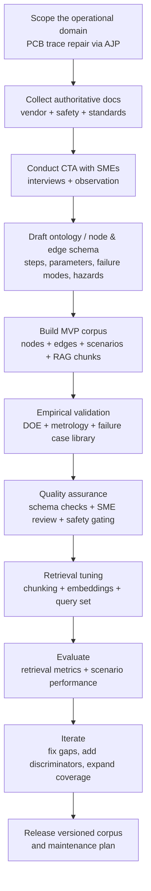
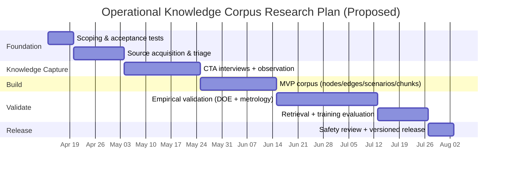

# Research Design for an Operational Knowledge Corpus for Optomec HD2 Aerosol Jet PCB Trace Repair

## Executive summary

The attached specification describes a project to build a structured, graph-ready operational knowledge corpus to train a novice engineering technician to independently run an aerosol jet printer for PCB trace repair, diagnose failures, and make safe decisions—explicitly emphasizing tacit expertise capture, failure discrimination, scenario realism, and natural-language retrievability. fileciteturn0file0

Aerosol Jet Printing (AJP) is a non-contact, CAD-driven direct-write process that aerosolizes functional ink, transports it with a carrier gas, and focuses it with an annular sheath gas through a nozzle, enabling fine features and a relatively large nozzle–substrate stand-off (commonly on the order of ~1–5 mm). citeturn10view0turn21view0turn22view0 This working-distance advantage is valuable for non-planar substrates but creates operational sensitivities (e.g., overspray, drift, parameter coupling) that must be encoded into training and troubleshooting artifacts. citeturn18view1turn21view0turn18view2

Safety and compliance are central: AJP frequently uses nanoparticle-based inks and may incorporate curing/processing modules (e.g., UV curing; IR laser curing; local exhaust), so the corpus needs safety gates and “abort criteria” at key decision points, aligned with authoritative nanomaterial exposure-control guidance and any system-specific hazards (compressed gases, solvents, moving stages, lasers). citeturn9view0turn8view0turn11view0turn22view0

A rigorous approach to answering the project’s implicit research questions is best framed as mixed-methods knowledge engineering: (a) cognitive task analysis and observation of experts to capture tacit cues and decision logic; (b) document-driven process decomposition and controlled experiments to link parameters → symptoms → faults → corrective actions; (c) formal knowledge representation and validation (graph constraints) plus retrieval evaluation (RAG + vector search metrics); and (d) scenario-based training evaluation to prove the corpus improves safety-critical behaviors and troubleshooting accuracy. citeturn17view0turn14view0turn15view2turn26view0turn27view0turn25view0

## Extracted research questions and implicit assumptions

### Restated research questions extracted from the attached markdown

The markdown does not pose a single interrogative sentence; instead, it specifies a target outcome and required artifacts. Interpreting that specification, the operative research questions are:

**How can aerosol-jet PCB trace repair operations on the Optomec HD2 (including tacit expert cues, safety decisions, and troubleshooting discrimination) be captured, structured, validated, and delivered as four interoperable artifact families—graph nodes, graph edges, scenario scripts, and vector-RAG chunks—so that a novice technician can operate independently and safely while diagnosing failures accurately?** fileciteturn0file0

Supporting sub-questions implied by the requirements include:

- **Operational decomposition:** What are the end-to-end steps (setup → startup → print → sinter/cure → verify → clean) with preconditions, actions, expected outcomes, abort criteria, and verification checks that define “correct operation” for PCB trace repair on an AJP platform? fileciteturn0file0  
- **Failure taxonomy and discrimination:** What failure modes (e.g., progressive clogging, adhesion failure, standoff error, incomplete sintering, continuity fail, wrong gas sequence) are most important, how do they manifest over time, and what observable signals best discriminate them from similar faults? fileciteturn0file0  
- **Knowledge representation and retrieval:** Which ontology/graph schema, edge semantics, and chunking/retrieval design yields consistent mapping from novice language and symptoms to the correct fault and next actions, while remaining “graph-ready” and “vector-retrievable”? fileciteturn0file0turn14view0turn15view2turn15view1  
- **Evaluation:** How can corpus quality be measured (coverage, consistency, retrieval success, scenario realism) and linked to learning outcomes (safe behavior, reduced troubleshooting errors, improved repair success)? fileciteturn0file0turn25view0turn26view0turn27view0  

### Implicit assumptions and constraints

The specification implies (or requires) several assumptions that should be made explicit:

- **Learner constraint:** The target learner is an engineering technician with general hands-on experience but no AJP experience, and must become able to run unsupervised and troubleshoot. fileciteturn0file0  
- **Artifact constraint:** The deliverable is not a narrative SOP or literature review; it must be a structured corpus usable as a knowledge graph, scenario-driven training set, and vector-retrieval troubleshooting base (four artifact families required). fileciteturn0file0  
- **Access constraint (likely):** Detailed Optomec user manuals and “recipes” may be gated behind customer portals; building a high-confidence corpus likely requires customer-level documentation access and SME participation. citeturn12view0turn22view0  
- **Equipment/process constraint:** The HD2/HD2-3X platform characteristics (working area, feature sizes, materials, gas requirements, optional curing modules, exhaust features, software/logging) shape the operational envelope and what must be captured. citeturn11view0turn22view0turn18view3  
- **Unspecified (must be clarified in implementation):** geography/site context, budget, number of machines, ink/material set, substrate types (FR-4 vs other PCB materials), repair acceptance standard (IPC class), and required throughput are not defined in the markdown. fileciteturn0file0turn13view0  

## Key terms and definitions

| Term | Practical definition for this project | Why it matters in the corpus |
|---|---|---|
| Aerosol Jet Printing (AJP) | A non-contact direct-write process that atomizes ink into micron-scale droplets, transports aerosol with a carrier gas, and focuses it with an annular sheath gas through a nozzle to deposit features at stand-off distances commonly in a ~1–5 mm range. citeturn21view0turn10view0turn22view0 | Defines the “physics + controls” that underpin steps, parameters, failure modes, and what signals are diagnostic. citeturn21view0turn18view2 |
| Carrier gas | Gas flow that transports the aerosolized ink from atomization toward the deposition head/nozzle. citeturn21view0turn10view0 | A core controllable parameter; interacts with sheath flow and affects focusing/line geometry. citeturn21view0 |
| Sheath gas | Annular flow surrounding the aerosol stream that collimates/focuses the jet and acts as an interlayer that can reduce nozzle-material contact and clogging. citeturn10view0turn21view0 | Central to “focusing ratio,” overspray, stability, and several failure discriminations (e.g., “wrong gas sequence”). citeturn21view0turn18view1 |
| Stand-off distance | Nozzle-to-substrate distance; AJP can maintain print quality over millimeter-scale offsets (often cited ~1–5 mm; many sources emphasize ~2–5 mm). citeturn21view0turn10view0turn18view1turn22view0 | Directly linked to standoff errors, line width variation, overspray, and risk of unintended contact/shorts. citeturn18view1turn21view0 |
| Overspray | Satellite deposition around the primary printed line, influenced by droplet size distribution, focusing, stand-off, and ink/evaporation dynamics. citeturn21view0turn18view1 | Critical for troubleshooting (e.g., short risk, weak conductivity) and for scenario realism (visual cue novices must learn). citeturn18view1turn21view0 |
| Process drift | Systematic change in deposition output over time (e.g., thickness/width drift) driven by evolving “hidden states” such as ink level/composition changes during printing; mitigations can include maintaining ink level/recirculation. citeturn18view2turn21view0 | Drives progressive failures and “temporal” tacit knowledge; should be encoded as trend-based diagnosis rather than single thresholds. citeturn18view2 |
| Sintering/curing | Post-deposition process that consolidates nanoparticle inks into a conductive metal trace; AJP platforms may support in-situ IR laser curing or UV curing depending on materials. citeturn18view3turn11view0turn22view0 | Underpins “incomplete sintering” and continuity failures, and introduces safety hazards (thermal/laser/UV). citeturn22view0turn9view0 |
| Knowledge graph | A structured knowledge base modeled as entities and relations; in industrial maintenance, KGs are commonly used to organize and deliver expert knowledge to assistants. citeturn14view0 | Aligns with the project’s “graph-ready” requirement and enables reasoning over symptom→fault→action chains. citeturn14view0 |
| RAG (Retrieval-Augmented Generation) | A system architecture combining retrieval from an external document/index with text generation; originally formalized for combining dense retrieval with generation for knowledge-intensive tasks. citeturn15view1 | Matches the “vector-retrievable troubleshooting system” requirement and motivates measurable retrieval performance targets. citeturn27view0turn26view0 |

## Evidence base and prioritized sources

### What the literature and official sources imply for corpus design

AJP’s operating principle implies that many practical failures are **parameter-coupled** (carrier/sheath flows, stand-off, droplet size distribution, evaporation, motion path). Official vendor descriptions emphasize aerodynamic focusing, typical use of clean dry nitrogen or compressed air as process gases, and maintenance-relevant claims that sheath gas insulates the nozzle to prevent clogging. citeturn10view0turn21view0turn22view0 This reinforces the corpus requirements to encode not just “what to set” but **how to interpret trends and cues** (sound/pressure changes, plume shape, progressive quality degradation) and when to abort. fileciteturn0file0turn18view2turn21view0

Vendor specs for HD-series systems show operational features that can be leveraged as data sources and safety controls: local (nozzle) exhaust, optional in-situ laser curing (including Class IV IR laser details in an HD-series sheet), UV curing, alignment cameras/vision tools, and automation software with alarms and data logging. citeturn11view0turn22view0 These become design inputs for the corpus: (1) what the operator sees in the UI, (2) signals available for troubleshooting, and (3) which hazards require gates and mastery thresholds. fileciteturn0file0

Peer-reviewed AJP reviews and process studies repeatedly highlight issues that map directly to required scenario injections (clog-related deposition problems, overspray, adhesion dependence on surface prep, drift). citeturn21view0turn18view2turn18view1 In particular, process drift tied to ink level/composition dynamics underscores why “onset timing,” “drift over time,” and “prior session effects” should be structural attributes of FailureMode and TacitKnowledge nodes, not just narrative notes. citeturn18view2turn21view0

Safety guidance for nanomaterials indicates a precautionary approach, emphasizing ventilation/HEPA filtration, exposure assessment, and training, especially for easily dispersed forms (powders, sprays, droplets). citeturn9view0turn16view0turn15view6 For silver nanomaterials, authoritative guidance explicitly derives a respirable REL for silver nanomaterials (<100 nm primary particle size) and reiterates a total silver REL—useful for framing facility EHS requirements and curriculum content on aerosol exposure controls. citeturn8view0

image_group{"layout":"carousel","aspect_ratio":"16:9","query":["Optomec Aerosol Jet printer HD2","aerosol jet printing nozzle focused aerosol stream sheath gas","aerosol jet printed conductive trace on PCB","aerosol jet printing overspray example microscopy"],"num_per_query":1}

### Top ten sources with brief annotations and links

| Source | Why it is highly relevant | Link |
|---|---|---|
| **entity["company","Optomec","additive manufacturing company"] “Aerosol Jet Technology” (official)** citeturn10view0 | Canonical vendor description of AJP mechanics (droplet size, sheath gas role, typical gases, stand-off distance, CAD/toolpath framing). Critical for ground-truthing parameter/step definitions and some failure mechanisms. citeturn10view0 | `https://optomec.com/printed-electronics/aerosol-jet-technology/` |
| Optomec “AJ HD2-3x” product specifications (official page contents) citeturn11view0 | Provides platform-relevant constraints: typical line width/thickness ranges, materials ranges, facility nitrogen requirements, exhaust, optional curing modules, and software/logging features—all must be reflected in training and troubleshooting artifacts. citeturn11view0 | `https://optomec.com/aj-hd2/` |
| Optomec “Aerosol Jet High Density Printed Electronics” (HD series sheet) citeturn22view0 | Consolidated spec sheet: stand-off tolerance, gas requirements (>99.9% nitrogen at 20 slpm), droplet sizing, optional Class IV IR laser module and UV curing, and process recipes references—useful for safety hazards, facility setup, and “recipes” concept. citeturn22view0 | `https://optomec.com/wp-content/uploads/2018/08/AJ-HD-Production-Sheets_WEB0818.pdf` |
| Wilkinson et al. (2019) open-access review PDF citeturn21view0 | Comprehensive peer-reviewed synthesis tying process parameters to outcomes (atomization modes, viscosity ranges, sheath effects, overspray discussions, focus ratio as key parameter, stand-off range). Foundation for a defensible failure-mode taxonomy and parameter nodes. citeturn21view0 | `https://eprints.whiterose.ac.uk/id/eprint/146144/7/Wilkinson2019_Article_AReviewOfAerosolJetPrintingANo.pdf` |
| Tafoya & Secor (2020) “process drift” record (OSTI) citeturn18view2 | Concrete mechanism for drift (ink level affecting atomization efficiency) and an engineering mitigation (maintaining ink level/recirculation), plus evidence of extended-run stability—directly supports scenario “progressive failures” and “prior session effects.” citeturn18view2 | `https://www.osti.gov/pages/biblio/1601270` |
| Ma et al. (2024) Nature Communications on overspray and stand-off citeturn18view1 | Modern, high-quality source connecting AJP’s standoff advantage to overspray/short-circuit risk and to parameter optimization; supports symptom descriptions and “consequence if missed” for overspray-related faults. citeturn18view1 | `https://www.nature.com/articles/s41467-024-50789-w` |
| **entity["organization","National Institute for Occupational Safety and Health","us agency"]** CIB 70 on silver nanomaterials (2021) citeturn8view0 | Authoritative health-effects synthesis and derived exposure limits (REL) for silver nanomaterials and total silver; anchors safety-hazard nodes and training gates for nanoparticle inks (especially silver). citeturn8view0 | `https://www.cdc.gov/niosh/docs/2021-112/default.html` |
| **entity["organization","Occupational Safety and Health Administration","us agency"]** “Working Safely with Nanomaterials” fact sheet (2013) citeturn9view0 | Practical control recommendations (ventilated enclosures, HEPA filtration, spill cleanup practices, training components) aligned with workplace implementation—useful for SafetyHazard nodes and scenario safety gates. citeturn9view0 | `https://www.osha.gov/sites/default/files/publications/OSHA_FS-3634.pdf` |
| IPC-7711C/7721C table of contents + scope excerpts (2017) citeturn13view0 | Industry standard framing for PCB rework/repair/modification, definitions, scope, and skill levels; supports aligning the trace-repair corpus with recognized repair terminology and acceptance context. citeturn13view0 | `https://www.electronics.org/TOC/IPC-TOC-7711-21C.pdf` |
| Teern et al. (2022) KG construction process for industrial maintenance (CEUR-WS) citeturn14view0 | Directly addresses how to build and maintain KGs for maintenance support, emphasizing iterative process stages and design challenges—strong methodological grounding for the “graph-ready” requirement. citeturn14view0 | `https://ceur-ws.org/Vol-3223/paper1.pdf` |

## Proposed methodologies, data, and analytical techniques

### Method family comparison

| Method family | What it answers best (mapped to the extracted questions) | Data needed | Recommended techniques | Key outputs to feed the required artifacts |
|---|---|---|---|---|
| Qualitative (knowledge elicitation) | Tacit cues (what experts notice; what novices miss), decision thresholds (abort vs continue), troubleshooting reasoning, scenario realism. fileciteturn0file0 | SME interviews; shadowing/observation; think-aloud on real failures; artifact review of logs/photos/video. citeturn17view0turn25view0 | Cognitive Task Analysis (CTA) combining interviews + observation; cross-SME peer review to reduce bias. citeturn17view0 | TacitKnowledge nodes; SocraticProbe nodes; decision points; scenario narration and mentor probes; discriminators between similar faults. fileciteturn0file0 |
| Quantitative (process characterization) | Parameter→outcome relationships; symptom signatures; discriminating thresholds; verification criteria (pass/fail). citeturn21view0turn18view1turn18view2 | Controlled print runs varying carrier/sheath flows, stand-off, speed, curing profiles; metrology (line width, thickness, resistance/continuity, adhesion tests); environmental and time-based logs. citeturn21view0turn11view0turn22view0 | Designed experiments; regression/response-surface modeling; classification for fault ID; time-series drift analysis; uncertainty quantification for “abort criteria.” citeturn18view2turn21view0 | Parameter nodes with empirically grounded ranges; VerificationCheck nodes with measurable criteria; FailureMode nodes with onset timing and signals; Consequence nodes tied to measurable degradation. fileciteturn0file0 |
| Computational (knowledge representation + retrieval) | “Graph-ready” structure, constraints, and queryability; RAG retrievability via novice/expert phrasing; evaluation of retrieval and grounding. fileciteturn0file0 | Structured node/edge corpus; query logs; gold-standard Q/A pairs; document chunks; embeddings index; schema constraints. citeturn15view2turn15view3turn15view1turn27view0 | Graph modeling + validation constraints (e.g., SHACL for rule/shape validation); IR evaluation (precision/recall curves; nDCG); RAG evaluation frameworks. citeturn15view2turn26view0turn26view3turn27view0 | Graph Edges satisfying required semantics; Vector-RAG chunks tuned to novice queries; retrieval test set and evaluation report; automated schema validation checks. fileciteturn0file0 |
| Mixed-methods integration | Produces a corpus that is both *accurate and usable*: SME realism + empirical discriminators + retrievability + training impact. fileciteturn0file0 | All above, sequenced iteratively. citeturn14view0 | Iterative build–test–revise cycle, aligned with KG construction lifecycle thinking in maintenance contexts. citeturn14view0 | MVP corpus → validated corpus → deployment-ready corpus with evaluation evidence. fileciteturn0file0 |

### Data needs and candidate datasets

Because public datasets for Optomec HD2 PCB trace repair are unlikely, the research design should assume **first-party dataset creation**. The good news is that vendor documentation indicates the platform supports automation software with alarms and data logging plus machine vision—meaning operational telemetry can likely be captured systematically. citeturn11view0turn22view0

| Dataset category | What to capture | How it will be used | Practical acquisition notes |
|---|---|---|---|
| Process settings logs | Carrier/sheath flow setpoints, stand-off, speed, nozzle type, material cassette type, cure schedule, job file/toolpath metadata. citeturn10view0turn21view0turn11view0turn22view0 | Build Parameter nodes and parameter interactions; label “wrong gas sequence” and standoff errors; create scenario triggers tied to specific settings. fileciteturn0file0 | Prefer automated export from control software/data logging where possible. citeturn11view0turn22view0 |
| In-process signals | Pressure/flow trends, alarms, shutter activity, time since startup, camera images/video of plume/jet and deposition region (if available). citeturn11view0turn22view0 | Symptom signatures; drift detection (trend vs value); discriminate partial vs full clogs and overspray conditions. citeturn18view2turn21view0turn18view1 | Prioritize capturing the signals the operator actually sees and uses. fileciteturn0file0 |
| Output metrology | Line width/thickness, continuity, resistance, visual defects/overspray, adhesion results, post-cure conductivity. citeturn18view1turn22view0turn21view0 | VerificationCheck nodes, pass/fail criteria, and consequences of missed faults (e.g., overspray → shorts; incomplete cure → high resistance). citeturn18view1turn18view3 | Align with the PCB repair acceptance context (IPC terminology/class) where applicable. citeturn13view0 |
| Troubleshooting case library | Real incidents with timestamped symptom description, onset timing, corrective steps taken, and outcome. citeturn18view2turn21view0 | Create FailureMode nodes with discrimination logic; build realistic Scenario Script fault injections and “missed consequence” nodes. fileciteturn0file0 | Enforce consistent case template; include “what surprised the operator.” citeturn17view0 |
| Safety/EHS artifacts | SDS for inks/solvents, ventilation specifications, exposure assessment results, laser/UV safety procedures, incident/near-miss logs (de-identified). citeturn9view0turn8view0turn22view0turn15view6 | SafetyHazard nodes; safety gates; mastery thresholds; compliance checklists. fileciteturn0file0 | Follow authoritative nanomaterial controls guidance; treat inks in spray/droplet form as high priority for containment. citeturn9view0turn16view0 |

### Sampling strategy

A practical sampling plan that matches the project’s intent:

- **Subject-matter experts (SMEs):** 3–6 experienced AJP operators/engineers for CTA interviews and peer review (to reduce single-expert bias). CTA literature emphasizes capturing both explicit and implicit knowledge and recommends structured elicitation approaches. citeturn17view0  
- **Target learners:** 6–12 technicians meeting the “hands-on but no AJP experience” profile, used in iterative pilot tests of scenarios and retrieval queries. fileciteturn0file0turn25view0  
- **Failure case sampling:** Purposively sample each required scenario category (nominal; partial clog; full clog; wrong gas sequence; adhesion failure; standoff error; incomplete sintering; continuity fail) and include both “clean” and “confusable” examples for discrimination training. fileciteturn0file0turn21view0turn18view2turn18view1  

### Metrics and evaluation framework

To meet the corpus “success criteria,” evaluation should operate at three interacting levels: **graph integrity**, **retrieval success**, and **training impact**. fileciteturn0file0

| Evaluation target | Primary metrics | How to measure |
|---|---|---|
| Graph/corpus completeness | Coverage rules from the prompt (per major concept: ≥1 node; ≥1 scenario; ≥3 chunks; ≥5 novice query forms) plus schema completeness (required fields present). fileciteturn0file0 | Automated checks against the node/edge YAML and chunk inventory; sampling audit by SMEs for correctness. citeturn14view0turn15view2 |
| Retrieval quality (vector + RAG) | Recall-oriented retrieval metrics (e.g., recall@k) plus ranked relevance metrics (precision/recall curves, nDCG) and RAG-specific evaluation dimensions (retrieval + generation + safety/grounding). citeturn26view0turn26view3turn27view0 | Build a test query set drawn from “novicePhrases/confusions” and scenario prompts; collect gold “linkedNodeIds” per query; compute metrics and do error analysis by failure mode. citeturn26view0turn27view0 |
| Training effectiveness | Scenario performance assessments: correct action selection, diagnostic accuracy, time to resolution, and safety-critical behavior adherence. Scenario-based training evaluation approaches commonly use pre/post assessment and engagement measures. citeturn25view0 | Pre/post instruments per scenario; rubric scoring; compare learning outcomes across scenario modalities (guided vs unguided) and difficulty tiers. citeturn25view0 |

### Methodology flowchart

## Step-by-step research plan with timeline and deliverables

The plan below assumes an MVP-first approach (usable corpus quickly), then iterative refinement. Timing is adjustable; constraints like budget/throughput/site policy are currently unspecified. fileciteturn0file0

| Phase | Target duration (weeks) | Key activities | Primary deliverables |
|---|---:|---|---|
| Scoping and requirements translation | 1 | Translate prompt requirements into a testable acceptance checklist (coverage, safety-critical mastery thresholds, scenario set); decide data formats and versioning. fileciteturn0file0 | Requirements-to-tests checklist; corpus schema spec (fields, IDs, naming, provenance). |
| Source acquisition and evidence triage | 2 | Acquire vendor docs (including customer portal materials if available) and safety/standards references; identify gaps that require SME elicitation. citeturn12view0turn22view0turn13view0turn9view0turn8view0 | Evidence map (Tier 1–3); annotated bibliography (locked to version). |
| CTA and tacit knowledge capture | 2–3 | Conduct CTA sessions and structured observation; extract cue patterns, decision thresholds, and common novice errors. citeturn17view0 | CTA transcripts + coded insights; initial TacitKnowledge + SocraticProbe drafts. |
| MVP corpus construction | 3 | Build first-pass Graph Nodes, Graph Edges, eight required Scenario Scripts, and initial Vector-RAG chunk set with novice query forms and retrieval hooks. fileciteturn0file0 | MVP corpus package (v0.1): nodes/edges/scenarios/chunks + gap list. |
| Empirical process + failure validation | 3–5 | Run controlled prints to link parameter changes to symptoms and outcomes; capture metrology and failure snippets aligned to required failure modes. citeturn21view0turn18view2turn18view1turn11view0 | Parameter ranges & discriminators; verified FailureMode nodes; updated VerificationChecks. |
| Retrieval and training evaluation | 2 | Build query test set; evaluate retrieval metrics and scenario performance with novice learners; iterate chunking/graph links based on errors. citeturn26view0turn27view0turn25view0 | Evaluation report; error taxonomy; corpus v0.2 with fixes. |
| Safety review and release | 1 | Validate SafetyHazard nodes and gates against EHS guidance; confirm laser/UV and nanomaterial controls; publish versioned release and ongoing maintenance process. citeturn9view0turn8view0turn22view0turn14view0 | Release v1.0; safety checklist; maintenance plan (update cadence, ownership). |

## Risks, limitations, and ethical considerations

A primary risk is **documentation access and provenance quality**. Vendor manuals and “process recipes” may be gated to customers, and the prompt requires source/provenance labeling (OfficialDoc vs PractitionerKnowledge vs inferred). Without access to Tier 1 sources and SMEs, the corpus may over-rely on inferred knowledge, lowering confidence and increasing safety risk. citeturn12view0turn22view0turn14view0

A second risk is **modeling complexity and confusability**: AJP outcomes depend on interacting parameters (flows, stand-off, ink properties, evaporation), so naive single-parameter troubleshooting trees can mislead. The literature highlights overspray, stand-off sensitivity, and time-based drift mechanisms, implying the corpus must encode *temporal diagnostics* and multi-signal discrimination. citeturn21view0turn18view1turn18view2

Safety and ethics risks are nontrivial because AJP often uses **nanomaterial-containing inks and aerosolized droplets**, plus compressed gases and potentially UV/laser curing modules (including Class IV laser in HD-series materials). Authoritative guidance supports precautionary exposure control (ventilation/HEPA, spill cleanup controls, training, exposure assessment), and silver nanomaterials have explicitly derived REL values. citeturn9view0turn8view0turn15view6turn22view0 The corpus should therefore treat safety-critical steps as **gated competencies** and avoid encouraging unsafe improvisation.

Data ethics concerns include: (a) **worker privacy** if logs/video capture operators; (b) **IP and confidentiality** (vendor documentation, proprietary recipes); and (c) **evaluation bias** if training data over-represents “easy” failures or a single expert’s style. These should be mitigated via de-identification, access control, and multi-SME review cycles. citeturn17view0turn14view0

## Recommended next steps and implementation resources

The fastest path to a defensible, deployable corpus is to secure Tier 1 sources and instrument real operations early.

First, obtain Optomec customer documentation and process “recipes” via the vendor support portal (Optocare) or internal lab SOPs, because this content directly anchors step sequences, maintenance procedures, and parameter defaults. citeturn12view0turn22view0 Second, establish the safety baseline for your exact ink set (especially silver nanoparticle inks) using SDS plus authoritative nanomaterial guidance and, where appropriate, exposure sampling plans. citeturn8view0turn9view0turn15view6 Third, run CTA with at least three experts and build a “failure case library” before writing large volumes of content—CTA is explicitly suited for capturing implicit expert knowledge for training and expert-system artifacts. citeturn17view0turn14view0

A practical implementation stack should explicitly separate (1) **graph integrity**, (2) **search/retrieval**, and (3) **scenario delivery**:

| Component | Recommended design choice (principle) | Rationale |
|---|---|---|
| Knowledge graph store | Use a graph model with enforceable schema/constraints; validate required fields and relation patterns during CI. citeturn15view2turn15view3 | SHACL-style validation is designed to validate RDF graphs against conditions (“shapes”) and can serve as an automated gate to keep node/edge quality high. citeturn15view2 |
| Retrieval layer (vector + hybrid) | Use retrieval evaluation as a first-class deliverable; optimize for recall on safety-critical topics; track nDCG and precision/recall curves. citeturn26view0turn26view3turn27view0 | IR evaluation literature emphasizes ranked retrieval evaluation; RAG evaluation surveys highlight the need for multi-component evaluation (retrieval + generation + safety). citeturn26view0turn27view0 |
| Scenario engine | Implement scenario scripts exactly as declared (phases, fault injections, safety gates), and log learner actions for continuous improvement. fileciteturn0file0turn25view0 | Scenario-based training evaluations often rely on pre/post measures and structured data capture; logging enables iterative improvements. citeturn25view0 |

Finally, convert the prompt’s “gaps for expert interview” requirement into an operational backlog: every *Low-confidence* or *InferredFromDomain* node should generate a specific interview question, and every high-severity SafetyHazard should be reviewed with EHS and validated against authoritative guidance (nanomaterials + system-specific hazards). fileciteturn0file0turn9view0turn8view0