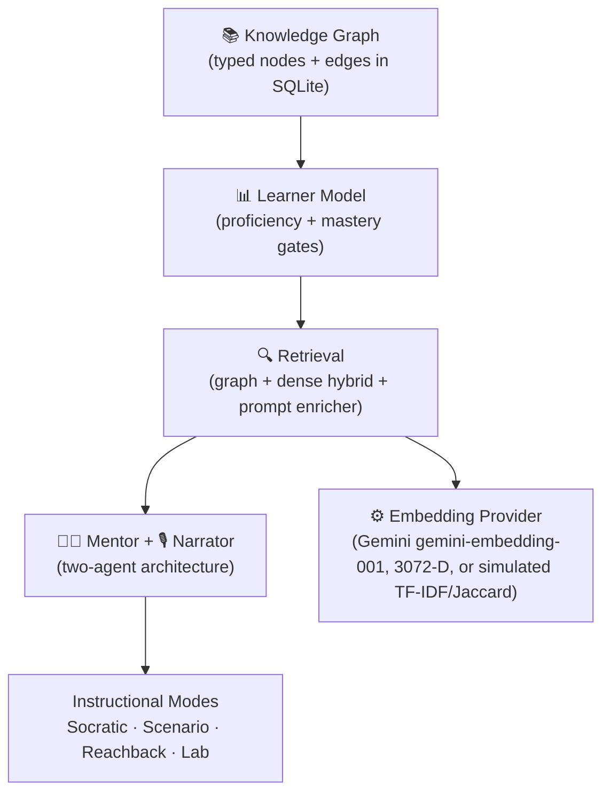
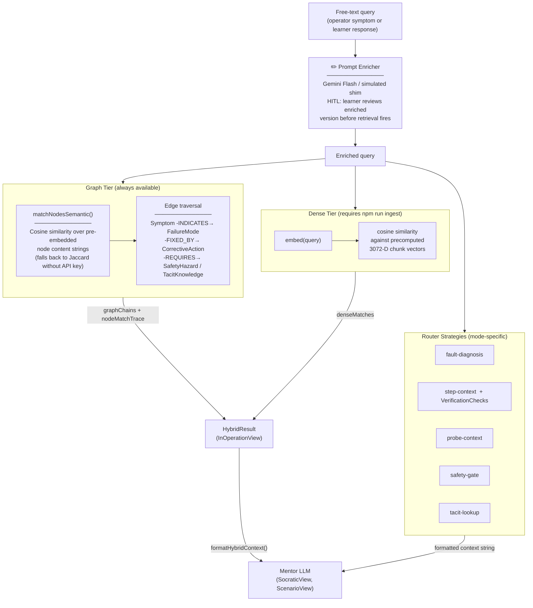
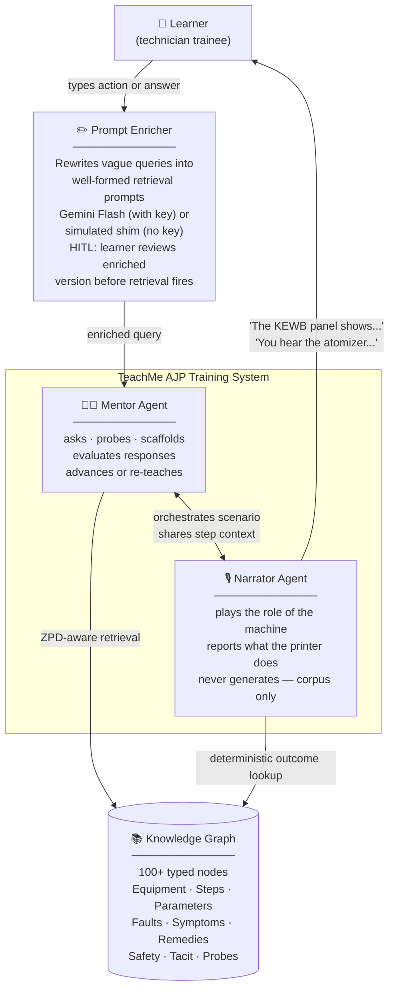
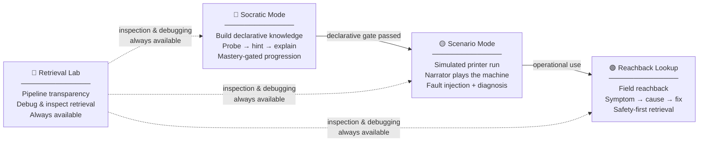

# TeachMe AJP — Retrieval-Augmented Operational Training for the Optomec HD2 Aerosol Jet Printer

## 1. Abstract
TeachMe AJP is an operational training system for technicians working with the Optomec HD2 Aerosol Jet Printer. The system applies retrieval-augmented generation principles to specialist equipment training: a typed knowledge graph replaces a flat document corpus, a two-agent architecture (Mentor + Narrator) replaces a single generative surface, and procedural and diagnostic competency replace generic Q&A as the primary outcome. The Narrator agent reads corpus nodes verbatim to report machine behavior, eliminating hallucination risk in a context where incorrect safety information has real consequences. Four instructional modes — Socratic Practice, Scenario Mode, Reachback Lookup, and Retrieval Lab — map naturally to technician training progression from onboarding through independent operation. Supporting surfaces — a global Mission/Pedagogy/AI Rationale drawer (reachable from every screen, not a training tab), an Architecture tab, and a RAG Coverage tab — expose the educational rationale, system flow, and evidence coverage without changing the instructional sequence. An interactive Workflow Demo with a Simulated Learner agent rounds out the system: it makes the full Mentor evaluation loop observable and inspectable without requiring a real learner in the seat. The central claim is that instructional utility, not topical overlap, should be the retrieval objective; and that safety-critical domains require retrieval systems whose outputs are traceable, auditable, and corpus-bounded by design. The system operationalizes this claim through what we call the TeachMe Loop: Signals → Retrieval → Mentor Loop → Safety Gate → Transfer.

## 2. Introduction
Specialist equipment training presents a problem that general-purpose language models handle poorly: the knowledge required is narrow, procedurally structured, safety-critical, and embedded in tacit expertise that is rarely fully documented. A technician learning to operate the Optomec HD2 needs more than accurate answers — they need answers delivered at the right complexity level, sequenced to build procedural fluency before independent operation, and guaranteed never to hallucinate safety-relevant information.

Retrieval-augmented systems improve factual grounding and reduce hallucinated responses by selecting verified context before generation. However, most retrieval systems are optimized for semantic relevance, not instructional sequencing. In a learning setting, a semantically accurate answer can still be instructionally wrong if it is delivered at the wrong complexity level or disconnected from the learner's current procedural state.

TeachMe AJP targets this gap. The system makes a direct claim: retrieval should optimize for instructional utility, and in safety-critical contexts, retrieval must be corpus-bounded so that every response is traceable to a verified source. This paper presents the conceptual grounding, architecture, and instructional design of that claim in practice.

### 2.1 Target Learner and Problem Bounds

TeachMe AJP is designed for a specific learner in a specific situation. Defining that learner precisely matters because the system's pedagogical choices, retrieval constraints, and mastery gate thresholds are all calibrated to this profile.

**Target learner profile:**
- **Role**: Engineering technician (not a research scientist or equipment engineer)
- **Equipment background**: Has completed general lab safety and instrumentation training; comfortable reading displays, following SOPs, and handling lab equipment, but has no prior hands-on experience with aerosol jet printing
- **AJP exposure**: Newly assigned to AJP operations; may have attended an orientation session or read the operator manual, but has not yet executed machine procedures independently
- **Goal**: Reach certified independent operation — able to run startup, execute print jobs, recognize fault signatures, and apply corrective actions without escalation

**What the system is not designed for:**
- Learners outside the five-level progression (see below) who need capabilities the system does not explicitly target
- Certified AJP experts who need real-time telemetry integration or live process control — Reachback Lookup is available to them, but the instructional progression targets the path to independent operation, not post-certification advanced analysis
- General-purpose querying against the Optomec manual — the retrieval system is calibrated for instructional sequencing, not arbitrary document search

**Retrieval system bounds:**
- The corpus is bounded by what subject-matter experts have authored and reviewed as knowledge graph nodes; the system cannot reason about equipment behavior not represented in the graph
- The Narrator's corpus-only constraint means any machine state not covered by a Step, Parameter, or FailureMode node cannot be narrated — coverage gaps become visible rather than hallucinated
- The simulated embedding provider (demo mode) uses TF-IDF/Jaccard approximation and is strong for deterministic reproducibility but limited for nuanced semantic matching; production deployment requires a real embedding backend
- Mastery gate thresholds are currently static and set by system designers, not learned from individual learner trajectory; a learner who masters concepts faster than expected will still step through the gate sequence
- The system has no real-time telemetry connection to a physical HD2 — it simulates machine behavior from corpus nodes, not live sensor data

## 3. Background and Related Work
### 3.1 Zone of Proximal Development and Scaffolding
Vygotsky's ZPD and scaffolding research motivate a core design rule: the highest-yield instructional material is often one step above current independent capability. Content far above learner state produces overload; content far below learner state produces stagnation. TeachMe AJP operationalizes this through mastery-gated progression — a technician must demonstrate procedural understanding before the system advances to more complex fault scenarios.

### 3.2 Transfer of Learning
Transfer theory distinguishes near transfer (similar context application) and far transfer (conceptual abstraction into dissimilar contexts). In operational training, near transfer means applying a known procedure to a slightly different machine state; far transfer means using underlying principles to diagnose a novel fault combination. TeachMe AJP treats transfer as a first-class target by including transfer-oriented retrieval paths and probes that push from procedural recall toward causal reasoning.

### 3.3 Intelligent Tutoring Systems and Learner Modeling
ITS literature demonstrates that adaptation quality depends on learner-state representation quality. TeachMe AJP uses a dual-axis learner model: concept-wise declarative proficiency tracked through Socratic probes, and procedural mastery tracked through scenario performance. This is intentionally simpler than full probabilistic knowledge tracing, but supports transparent, auditable decisions about when to gate progression and when to re-teach.

### 3.4 Retrieval-Augmented Architectures
RAG and related work establish that retrieval policy materially affects downstream model behavior. TeachMe AJP extends this from "retrieval for factual grounding" to "retrieval for learning progression." The core innovation is not the embedding model; it is the instructional objective embedded in retrieval routing, and the corpus-only constraint on the Narrator that makes safety-critical responses trustworthy.

### 3.5 Situated and Role-Based Learning
Situated-learning and cognitive-apprenticeship perspectives suggest that context matters for comprehension and retention. Equipment training is inherently situated — a technician needs to learn the procedure in the context of the machine's observable behavior, not as abstract text. The Narrator agent is designed to produce this situated context: every response it generates is anchored to a specific observable on the physical machine.

### 3.6 Cognitive Load and Sequencing
Cognitive load theory provides a practical rationale for the instructional mode progression. Introducing fault diagnosis before a technician understands startup procedures imposes heavy extraneous load. The mastery-gated Socratic → Scenario → Reachback Lookup progression is designed to build germane challenge incrementally while avoiding avoidable overload from mistimed complexity. The same theory drives the operator-state toggle: in high-stress operations mode, comprehensive training surfaces are locked and only Dashboard + Reachback Lookup remain reachable.

### 3.7 Problem-Based Learning
Problem-based learning (PBL) places learners in realistic problem scenarios before they have complete knowledge, driving knowledge acquisition through the process of confronting and resolving authentic problems. Evidence for PBL consistently favors far-transfer outcomes over direct instruction alone — learners trained on problems rather than expositions are better at handling novel fault combinations they have not seen before. TeachMe AJP operationalizes PBL in Scenario Mode: the learner is put into a running printer simulation with fault conditions injected at pedagogically planned points, and must reason through diagnosis and corrective action without a recipe. The Mentor never simply provides the answer; it scaffolds the reasoning process through probing questions and hints calibrated to current learner state.

### 3.8 Socratic Method and the Testing Effect
Socratic dialogue — the practice of driving understanding through structured questioning rather than exposition — has two independent empirical foundations in the learning sciences. The first is constructivist: understanding is built through active reasoning, not passive absorption of correct answers. The second is the testing effect (retrieval practice): actively retrieving information from memory during learning produces substantially more durable long-term retention than re-reading or re-studying the same material, even when the test attempt fails. TeachMe AJP uses Socratic probes not only to evaluate current understanding but as the primary mechanism for building that understanding — each probe attempt, whether correct or not, strengthens the memory trace for the underlying concept.

## 4. System Design
### 4.1 Architecture Overview

The AJP system is organized into five coordinated layers:
1. **Knowledge Graph layer**: 100+ typed nodes (Equipment, Step, Parameter, FailureMode, Symptom, CorrectiveAction, SafetyHazard, TacitKnowledge, SocraticProbe) stored in SQLite with typed edges.
2. **Learner Model layer**: dual-axis proficiency state — declarative concept scores updated through Socratic probes, procedural mastery updated through scenario performance.
3. **Retrieval layer**: graph traversal + dense vector search + mode-specific router, with a Prompt Enricher preprocessing queries before retrieval fires.
4. **Agent layer**: Mentor (teaches, probes, gates) and Narrator (reports machine behavior verbatim from corpus nodes).
5. **Instructional Mode layer**: four modes (Socratic, Scenario, Reachback Lookup, Retrieval Lab) each calling retrieval and the agent layer differently.

### 4.2 Knowledge Graph
The knowledge graph is the authoritative knowledge source for the system. All Narrator responses and all retrieval results are drawn from graph nodes — nothing is generated from model weights alone.

Node types and their instructional roles:

| Node Type | Role in System |
|---|---|
| Equipment | Physical components; anchor for parameter ranges and startup steps |
| Step | Procedural sequence nodes; carry NEXT_STEP edges for simulation |
| Parameter | Measurable values; carry acceptable range metadata |
| FailureMode | Fault conditions; connected to symptoms and corrective actions |
| Symptom | Observable signals; entry points for Reachback Lookup traversal |
| CorrectiveAction | Verified remediation procedures |
| SafetyHazard | Co-retrieved with any fault — never filtered out |
| TacitKnowledge | Expert intuition nodes; bridge procedural steps to causal understanding |
| SocraticProbe | Questions attached to steps and concepts; drive Socratic mode |

Six fault domains covered: Fluidic/Atomization · Gas System · Deposition Quality · Substrate/Adhesion · Post-Process · System/Software

### 4.3 Retrieval System
The retrieval system has three tiers, all of which receive an enriched query from the Prompt Enricher rather than the raw learner input.

**Graph tier** is always available and runs at query time. Semantic matching finds candidate nodes; edge traversal co-retrieves safety hazards and tacit knowledge along causal chains.

**Dense tier** activates after `npm run ingest` generates `public/ajp-corpus.json` with pre-embedded SOP and paper text. Fuses with graph results for Reachback Lookup.

**Router** is called with an explicit mode by each UI component. Five strategy modes dispatch to different graph traversal patterns depending on which instructional mode is active.

### 4.4 Three-Agent Architecture
The system uses three agents with explicitly non-overlapping responsibilities:

**Mentor** (Gemini Flash): teaches, probes, scaffolds, evaluates responses, and controls progression. The Mentor can ask follow-up questions, detect misconceptions, and decide whether to re-teach or advance. It cannot simulate machine behavior.

**Narrator**: reports what the machine does or shows after each learner action. Every Narrator response is drawn verbatim (or lightly templated) from a corpus node. The Narrator cannot teach, evaluate, or generate responses from model weights. This corpus-only constraint is what makes the system trustworthy in a safety-critical context.

**Simulated Learner** (Gemini Flash): generates plausible learner responses at a specified expertise level for use in the Workflow Demo's simulate mode. The Simulated Learner is not a training artifact — it is an evaluation infrastructure component that makes the full Mentor evaluation loop observable without requiring a real learner in the seat. It uses the expertise level selected in the demo setup to modulate response depth and accuracy, enabling audiences to observe how the Mentor handles responses at different proficiency bands. The Simulated Learner is not used in any live instructional mode; it activates only when simulate mode is explicitly enabled.

**Prompt Enricher**: reformulates vague learner queries into well-formed retrieval prompts before retrieval fires. Uses Gemini Flash with an API key or a deterministic shim without one. The learner reviews the enriched version before retrieval executes (HITL checkpoint).

### 4.5 Learner Model and Mastery Gates
The learner model tracks two axes of competency:

- **Declarative proficiency**: concept-level scores updated through Socratic probe performance. Measured per knowledge concept (e.g., atomizer gas dynamics, substrate adhesion, nanoparticle safety handling).
- **Procedural mastery**: updated through Scenario mode performance. Measured by correct action sequencing, fault detection speed, and diagnosis accuracy.

Mastery gates control mode progression. A technician cannot enter Scenario mode until declarative proficiency thresholds are met in the relevant concept areas. This prevents scenario failure from premature exposure rather than genuine misunderstanding.

#### 4.5.1 Five-Level Expertise Continuum

The system explicitly supports a five-level learner expertise model that determines probe selection, retrieval depth, and mentor scaffolding intensity:

| Level | Label | Profile | Probe set |
|---|---|---|---|
| 1 | **Complete Novice** | No relevant engineering or lab background; no AJP vocabulary | 3 foundational probes (safety-critical fundamentals only) |
| 2 | **Novice** | Engineering tech experience, no AJP vocabulary | 3 foundational probes |
| 3 | **Naive** | AJP vocabulary from manual or classroom, no hands-on experience | 6 core-operations probes |
| 4 | **Intermediate** | Supervised hands-on experience; knows procedures but not all mechanisms | 6 core-operations probes |
| 5 | **Proficient** | Full SOPs, machine physics, and perceptual signals | All 11 probes including perceptual and abort-decision |

This continuum replaces the earlier novice/technician/expert trichotomy. The key change is explicit support for Level 1 (Complete Novice): the system does not exclude learners with no prior lab experience. Instead, it routes them to the smallest, highest-safety-density probe set and intensifies scaffolding. The prior assumption that "complete novices need not apply" reflected a deployment decision, not a system constraint; it has been removed.

### 4.6 Embedding Backends and Reproducibility
TeachMe AJP supports interchangeable embedding providers through a shared interface. For no-key demo operation and deterministic regression testing, the platform uses `SimulatedEmbeddingProvider` (`src/engine/retrieval/simulated-provider.ts`), which computes deterministic TF-IDF vectors and cosine similarity. Gemini embedding (`gemini-embedding-001`, 3072-D vectors) activates when an API key is present, providing richer semantic matching for production use.

The separation between embedding provider and retrieval routing logic is intentional: changes to the embedding backend do not affect graph traversal strategy, router dispatch, or mastery gate logic.

Dense-tier retrieval enforces a single embedding model per corpus: query vectors are only scored against chunk vectors produced by the same model (`src/engine/retrieval/dense-retrieval.ts`). Mixing embedding sources within one corpus is rejected rather than silently degraded, so a provider swap always requires a fresh, consistently-embedded corpus rather than a partial re-embed.

### 4.6.1 Ingestion Pipeline

`public/ajp-corpus.json` — the chunk + embedding artifact the dense tier loads at runtime — is produced offline by `npm run ingest` (`scripts/ingest-corpus.ts`), which fetches or reads ~19 curated sources (public SOPs, peer-reviewed papers, and OEM documentation), extracts text (Gemini multimodal extraction for PDFs, regex tag-stripping for HTML), chunks it into ~350-word overlapping windows, and embeds each chunk. This is the authoritative pipeline: the committed corpus is always generated by this script, not by the newer `scripts/db/*` SQLite-backed pipeline, which stages the same steps through a local database (for caching and idempotency across re-runs) but is not yet wired into the runtime build.

Extraction and embedding calls run against Gemini's free tier, which is rate-limited; a source that hits a `429`/`503` during a run is retried with exponential backoff, and a source that still fails after retries is reported in a loud, itemized failure summary rather than silently contributing zero chunks. By default, `npm run ingest` exits non-zero when any source fails, so a partial corpus is never mistaken for a complete one; an explicit `--allow-partial` flag opts into accepting a partial run, and `--retry-failed-only` re-runs just the sources that failed in the last attempt without re-embedding sources that already succeeded.

### 4.6.2 Provider Options

Gemini is the primary provider for both embeddings and the three chat-completion services (Mentor, Prompt Enricher, Simulated Learner). GitHub Models — a free chat-completion API authenticated with a personal GitHub token — is available as an alternative provider for those same three chat-completion services (`src/engine/llm/github-models-provider.ts`), selectable via a `VITE_LLM_PROVIDER` setting or automatically when a Gemini key is absent but a GitHub token is present. This exists to diversify inference away from a single free-tier quota, not to increase total throughput — GitHub Models' own free-tier limits are comparable to Gemini's.

GitHub Models is **not** used for embeddings. Its embeddings endpoint requires an organization with Models access enabled (not a plain personal-access-token flow available to an individual account), and — per the single-embedding-model-per-corpus constraint above — a second embedding provider could not share the existing Gemini-embedded corpus's vector space regardless; it would require its own independently-embedded corpus artifact. This is left as a possible future extension, not a current capability.

### 4.7 The TeachMe Loop

The five-stage operational narrative that unifies the system's design is referred to as the TeachMe Loop:

**Signals → Retrieval → Mentor Loop → Safety Gate → Transfer**

1. **Signals**: An operator captures observations — machine telemetry plus tacit cues (sound, smell, visual artifacts, pressure readings) — turning "something feels off" into a structured evidence record.
2. **Retrieval**: Graph + corpus retrieval surfaces grounded procedural and fault context matched to the current signal set and learner state. Not search — targeted selection of the next-best evidence and action.
3. **Mentor Loop**: Socratic probing evaluates reasoning quality, not just answer selection. The Mentor asks about evidence, mechanism, and falsifiability — coaching how the technician thinks, not just what they conclude.
4. **Safety Gate**: High-consequence steps require demonstrated prerequisite understanding before the system advances. Safety gates are explicit, inspectable, and auditable — a gate can say exactly what is missing and what would clear it.
5. **Transfer**: Assessment targets novel fault scenarios to validate that skill transferred, not merely that the last case was memorized.

This loop is the organizing principle for all four instructional modes and the Workflow Demo. The in-app Architecture tab presents the same loop as an inspectable flow; the Mission/Pedagogy/AI Rationale drawer, opened from a persistent masthead trigger rather than a training tab, carries the educational rationale and whitepaper link.

### 4.8 Workflow Demo

The Workflow Demo is a three-phase interactive capability that makes the Mentor evaluation loop observable and inspectable outside of a formal training session:

**Phase 1 — Setup**: The presenter or evaluator selects a learner name, expertise level (from the five-level continuum), and interaction mode (Manual or Simulate).

**Phase 2 — Practice**: Probe-by-probe Socratic interaction. In Manual mode, a human types free-text responses; the Mentor evaluates them and provides grounded feedback. In Simulate mode, the Simulated Learner generates responses automatically at the chosen expertise level, creating a fully automated Learner → Mentor loop that can be paused, resumed, and rewound.

**Phase 3 — Results**: A per-concept mastery summary showing which probes were demonstrated, which are still developing, and the aggregate mastery rate across the session.

The Workflow Demo serves two distinct purposes: (1) as a live demonstration tool for external audiences who cannot participate in a full training session, and (2) as an internal evaluation surface for validating Mentor behavior across expertise levels before exposing the system to real learners.

## 5. Instructional Design

### 5.0 Primary Learning Concepts

Each layer of the system is grounded in a primary pedagogical theory. The table below maps the theories to the system components they directly motivate.

| Learning Theory | Core Claim | System Element |
|---|---|---|
| **Zone of Proximal Development** (Vygotsky) | Highest-yield instruction sits one step above current independent capability | Mastery gates; ZPD-aware retrieval routing; probe difficulty calibration |
| **Socratic Method / Testing Effect** | Active retrieval builds durable understanding better than passive exposition | Socratic Mode: probe → hint → explain cycle; mastery-gated advancement |
| **Problem-Based Learning** | Learning through authentic problem confrontation produces far-transfer capability | Scenario Mode: full simulated printer run with deterministic fault injection |
| **Cognitive Load Theory** | Extraneous load from mistimed complexity blocks germane learning | Declarative-before-procedural gate; Narrator handling simulation fidelity so Mentor handles instruction |
| **Situated Learning** | Context matching between training and operational environment improves retention and transfer | Scenario Mode narrative context; Reachback Lookup designed for live field use, not classroom use |
| **Cognitive Apprenticeship** | Expert tacit knowledge must be made observable for novices to acquire it | Narrator verbatim corpus; TacitKnowledge nodes; REQUIRES edges co-retrieving expert intuition with procedural steps |
| **Mastery Learning** (Bloom) | Learners should not advance until prerequisite competency is demonstrated | Dual-axis mastery gates: declarative proficiency before Scenario, scenario performance before independent operation |
| **Transfer of Learning** | Near transfer (similar context) and far transfer (novel context) require different instructional targets | Transfer-oriented retrieval paths; probes that push from procedural recall toward causal reasoning |

These are not independent design choices layered on top of a retrieval system — they are the primary design constraints that determine what the retrieval system must return and when.

### 5.1 Four Instructional Modes

The first three modes form a natural training progression. Retrieval Lab is available at all stages and is not gated.

### 5.2 Socratic Practice

**Why Socratic method here:** Technicians assigned to AJP after basic lab training often enter with procedural familiarity — they can follow steps — but limited causal understanding of why each step matters. A technician who increases sheath gas pressure without understanding why may do so correctly in training but incorrectly when conditions deviate. Socratic probing surfaces this gap by requiring the learner to articulate the mechanism, not just the action. The probe → hint → explain cycle exploits the testing effect: each retrieval attempt, even an incorrect one, builds stronger long-term memory traces than passive reading of the same content. The Mentor's ZPD-aware probe sequencing ensures questions stay in the productive difficulty band — challenging enough to require reasoning, not so complex as to produce learned helplessness.

The Socratic mode builds declarative knowledge through mastery-gated probe sequences. The Mentor retrieves SocraticProbe nodes attached to the current learning target, presents them in sequence, provides hints when needed, and advances or re-teaches based on response quality. A concept is considered mastered when the learner can answer a probe correctly without hints and correctly explain the underlying mechanism.

### 5.3 Scenario Mode

**Why problem-based learning here:** Real AJP faults do not announce themselves. A pressure anomaly could be a partial clog, a leak, a misconfigured parameter, or early nozzle wear — and the diagnostic path through each is different. Direct instruction can present these fault trees, but it cannot reproduce the cognitive experience of encountering an unexpected symptom mid-run and having to reason through it under uncertainty. Problem-based learning research consistently shows that this kind of authentic problem confrontation — before the learner has complete knowledge — produces far-transfer capability that direct instruction does not. Scenario Mode operationalizes this: faults are injected deterministically at pedagogically planned moments, the learner cannot predict when or what, and the Mentor scaffolds the diagnostic reasoning without providing answers. The Narrator's corpus-only machine responses ensure the learner is reasoning about real machine behavior, not LLM-generated plausible fiction.

Scenario mode is the core training surface. The Mentor orchestrates a simulated printer run with the Narrator playing the role of the machine. The learner types actions; the Narrator reports observable machine responses drawn from Step and Parameter nodes; the Mentor evaluates the action, asks probing questions, and can inject fault conditions at predetermined points in the procedure.

Fault injection is deterministic and tied to the knowledge graph: when the Mentor injects a fault, the Narrator's subsequent responses come from FailureMode → Symptom chains in the graph. The learner must diagnose the fault using observable signals, then propose and execute the CorrectiveAction. Safety hazards co-retrieved with each FailureMode are surfaced by the Narrator before any corrective action is confirmed.

### 5.4 Reachback Lookup

**Why situated learning here:** Once a technician reaches independent operation, the learning context shifts from a classroom or training session to a live print run. Situated learning research argues that knowledge is most durable and transferable when it is acquired and used in contexts that match its intended application. Reachback Lookup is designed explicitly for that operational context — a technician in front of a running machine, not at a desk reviewing material. The query interface accepts natural symptom language ("the pressure is dropping and the plume looks thin") rather than structured fault codes, because that is how a technician in the field describes a problem. Safety-first retrieval is the dominant constraint in this mode: a corrective action recommendation that is technically correct but delivered without its associated safety hazards is worse than no recommendation, because the technician might act on it.

Reachback Lookup is designed for field reachback during live operations — a technician who encounters an unexpected machine state can query the system with a symptom description and receive a structured response: probable fault → causal chain → corrective actions → safety requirements. Retrieval fuses graph traversal with dense vector search against SOP text to maximize coverage. In high-stress ops mode it remains available while instructional surfaces are locked.

Safety-first retrieval means SafetyHazard nodes are always co-retrieved and displayed before corrective action recommendations, regardless of whether the learner explicitly asked about safety.

### 5.5 Retrieval Lab

**Why pipeline transparency here:** Instructors deploying the system need to know what the retrieval system returns for a given query before putting it in front of learners. A retrieval system that is opaque to instructors cannot be trusted for safety-critical training — if an instructor cannot inspect and validate what the system will surface for a fault scenario, they cannot take responsibility for what the learner internalizes. Retrieval Lab is not a learning mode for technicians; it is a governance tool for instructors and developers. It is kept always-available and unblocked by mastery gates because the people who need it most are the people configuring and validating the system, not completing a training progression.

Retrieval Lab exposes the retrieval pipeline for inspection. Any query can be run against the system and the full result set is displayed: matched nodes with similarity scores, traversed edge chains, dense match results, and the router strategy that was dispatched. This mode is designed for developers debugging retrieval behavior and for instructors reviewing what the system returns for a given query before deploying it to learners.

## 6. System Quality and Evaluation
### 6.1 Retrieval Quality Measures
The system tracks standard IR quality metrics against hand-labeled relevance sets:
- MRR (mean reciprocal rank)
- Precision@k / Recall@k
- nDCG
- Retrieval diversity (avoidance of redundant node returns)

Safety coverage is tracked separately: for any fault-related query, the fraction of responses that include at least one SafetyHazard node must be 1.0. This is a hard constraint, not an optimization target.

### 6.2 Operational Capability Metrics
For production deployment evaluation, the system tracks:
- **Problem resolution rate**: resolved technician queries within target window / total queries
- **First-pass resolution rate**: cases resolved without escalation or reopen / total cases
- **Time to detect, contain, and recover** (MTTD / MTTC / MTTR at p50/p90)
- **Mastery gate accuracy**: rate at which gate passages predict successful independent operation
- **Retrieval traceability**: fraction of responses with complete graph chain or dense match logs

### 6.3 Learner Outcome Measures
For supervised training evaluation:
- Declarative proficiency gain (pre/post Socratic probe performance)
- Scenario task completion rate and fault diagnosis accuracy
- Time-to-correct-diagnosis across fault types
- Hint dependency ratio (decreasing hint use as training progresses is a positive signal)

## 7. Discussion
### 7.1 Why the Narrator's Corpus-Only Constraint Matters
A generative Narrator that produced plausible-sounding machine behavior from model weights would be dangerous in a safety-critical training context. A technician who internalizes a hallucinated parameter value or safety procedure during training is more dangerous after training than before. The corpus-only Narrator is not a technical limitation; it is a design requirement. Every observable it reports must trace to a node in the knowledge graph that a subject-matter expert has reviewed.

### 7.2 Graph Retrieval vs. Flat Vector Search
Flat vector search returns semantically similar text chunks. Graph traversal returns causally connected nodes — the fault that matches the symptom, the safety hazard attached to the fault, the tacit knowledge node that explains why the fault behaves the way it does. For procedural and diagnostic training, causal structure is more useful than semantic similarity. The hybrid approach (graph + dense) captures both: graph for structural reasoning, dense for coverage of SOP text not yet in the graph.

### 7.3 Mastery Gates and Progression Control
Mastery gates serve two purposes. First, they enforce a pedagogically sound sequence — declarative understanding before procedural practice. Second, they give instructors a meaningful control surface: an instructor can inspect the gate thresholds, see where learners are getting stuck, and adjust the probe difficulty or the gate threshold for a specific concept. This is more actionable than an opaque adaptive system that changes behavior without explanation.

### 7.4 Prompt Enrichment and Human-in-the-Loop
Vague queries ("something's wrong with the flow") are common from novice technicians and produce poor retrieval results. The Prompt Enricher rewrites these into well-formed retrieval prompts before retrieval fires. The HITL checkpoint — showing the learner the enriched query before retrieval executes — serves two functions: it catches enrichment errors, and it teaches the learner what a well-formed query looks like, improving their own diagnostic language over time.

### 7.5 Limitations and System Bounds

The problem bounds defined in Section 2.1 are also the primary limitation boundary. The system is designed for a specific learner in a specific situation; using it outside those bounds is not a usage error — it is a deployment decision that should be made deliberately, with these constraints in view.

**Knowledge representation limits:**
- Knowledge graph nodes require expert authoring and review; coverage is bounded by the time invested in node creation. Faults not represented in the graph cannot be narrated or diagnosed by the system — coverage gaps produce "I cannot find information on that" rather than hallucinated guidance, which is the correct failure mode but still a limitation.
- The graph currently covers six fault domains; machine failure modes outside those domains are not represented.

**Retrieval system limits:**
- The simulated embedding provider is strong for reproducibility but limited for semantic realism; queries using non-standard terminology for a symptom may miss relevant nodes even when the concept is in the graph. Production deployment requires real embedding.
- Graph traversal retrieves causally connected nodes but cannot surface connections that were not explicitly encoded by the knowledge author. An expert who knows an undocumented shortcut diagnostic path cannot pass that knowledge to the system until it is encoded as a TacitKnowledge node.
- Prompt enrichment (the Prompt Enricher) rewrites vague queries before retrieval fires, but enrichment is only as good as the underlying model's understanding of AJP domain vocabulary. The HITL checkpoint is the primary safeguard against poor enrichment.

**Learner model limits:**
- Mastery gate thresholds are currently static; a learner who demonstrates conceptual understanding faster than average still completes the full gate sequence. Dynamic threshold adjustment by learner trajectory is not yet implemented.
- The dual-axis learner model (declarative + procedural) does not currently track within-session fatigue, attention, or emotional state — all of which affect learning in real operational training contexts.
- No longitudinal retention data yet; the system measures performance during training but not delayed recall at 7, 30, or 90 days.

**Instructional design limits:**
- Scenario Mode fault injection is deterministic and tied to a pre-designed scenario script. The system does not yet generate novel fault scenarios or combine faults in combinations not explicitly authored. A learner who sees the same scenario sequence twice will encounter the same fault injection points.
- The Socratic probe sequence is graph-attached, not dynamically generated; the system has a fixed probe vocabulary per concept.

## 8. Implications and Future Work
### 8.1 Deployment and Governance
The AJP system is designed to deploy alongside physical hardware, not only in simulation. Key governance requirements before any production use:

- expert-reviewed node content for every FailureMode, SafetyHazard, and CorrectiveAction node
- instructor-visible mastery gate controls with per-concept threshold adjustment
- per-retrieval traceability (graph chain + dense match logs stored per session)
- safe fallback to static SOP display if retrieval fails or confidence is below threshold

The four-mode structure maps to training roles: Socratic for onboarding, Scenario for supervised practice, Reachback Lookup for independent operations, Lab for continuous improvement and quality review. Source dispositions for every corpus input are recorded in `sources/SOURCES_LOG.md`; the data-store map lives in `docs/DATA_CATALOG.md`.

### 8.2 Human-Subjects Validation Plan
Current evaluation is system-level (retrieval quality, node coverage, gate accuracy). The next validation step is a controlled study with real HD2 technicians comparing training outcomes with and without the system. Key outcomes: fault diagnosis accuracy, time-to-correct-diagnosis, retention at 30 days, and perceived cognitive load.

### 8.3 Broader Domain Portability
The architecture is domain-agnostic if three ingredients are present:
- a typed knowledge graph with causal structure (not just a flat chunk store)
- safety or compliance nodes that must always co-retrieve with relevant faults
- subject-matter expert authoring of node content before deployment

This enables extension to other specialist equipment domains (e.g., other precision deposition systems, industrial process equipment) without redesigning the retrieval engine or agent architecture.

### 8.4 Research Directions
Future research directions include:
- dynamic mastery gate adjustment by learner trajectory
- richer learner-model estimation (Bayesian knowledge tracing variants)
- causal analysis of graph traversal depth vs. diagnostic outcome quality
- long-horizon retention measurement and delayed-transfer assessment
- multi-technician collaborative training scenarios

## 9. Conclusion
TeachMe AJP demonstrates that retrieval can function as pedagogy, not only search — and that in safety-critical domains, the retrieval system's trustworthiness is as important as its relevance. A knowledge graph replaces a flat chunk corpus to make causal structure retrievable. A corpus-only Narrator replaces a generative response surface to make safety-relevant outputs verifiable. Mastery gates replace passive content delivery to make progression controlled and inspectable. Together, these design choices operationalize a single principle: instructional utility and safety traceability, not topical overlap alone, should be the retrieval objective.

## 10. References
See the annotated bibliography in [references.md](./references.md).
